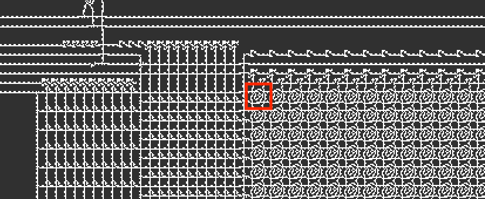

# Building and Running the Lisp in Life Pattern

This file explains how to load the Lisp interpreter (written in C) to the Game of Life pattern, and also how to load a custom Lisp program into the pattern to run it on Game of Life.

The build process uses a custom Life-like rule called Varlife, defined in the [Quest For Tetris](https://codegolf.stackexchange.com/questions/11880/build-a-working-game-of-tetris-in-conways-game-of-life) (QFT) Project, as an intermediate representation for creating a working Conway's Game of Life pattern. Once you obtain the Game of Life pattern with the Lisp program loaded into the RAM, the pattern can be run on the Conway's Game of Life rule. The values of the RAM module of a running Game of Life pattern can also be read out any time. There is a work-in-progress script to also write a given program into a pattern with a blank RAM module, which allows one to load and run Lisp programs with operations closed in the Game of Life space.


## Requirements
- Golly (version 4.0)
- Python 3.*
  - pyparsing>=2.3.1
  - numpy
  - hy>=0.14.0 (used for testing)
  - matplotlib (optional, required for creating memory access plots)
- git, gcc, make


## Building the Game of Life Pattern
Building the Game of Life pattern consists of four steps:

1. Building the assembly (QFTASM) file for the Lisp interpreter
2. Building the Varlife pattern for the Lisp interpreter
3. Loading the Lisp program into the Varlife pattern's RAM module
4. Metafying the Varlife pattern to a Conway's Game of Life pattern

The results after Step 2 is included in this repo as [./QFT-devkit/QFT_hashedrom_v11_interpreter.mc](./QFT-devkit/QFT_hashedrom_v11_interpreter.mc). If you are trying to load a custom Lisp program into the pattern, you can use this file and start from Step 3.


### 1. Building the assembly (QFTASM) file for the Lisp interpreter
First, initialize the git submodules and then run `make all`.

```sh
git submodule update --init --recursive
make all
```

This will create the following files:
- `./out/lisp.qftasm` : The assembly file for the Lisp interpreter
- `./out/ramdump.csv` : The initial values of the RAM to be loaded before running. Contains the results of various precalculations such as the string hashtable construction.

These files should be identical to `./qftasm/lisp.qftasm` and `./qftasm/ramdump.csv`.

### 2. Building the Varlife pattern for the Lisp interpreter
The following steps are done on Golly.

1. Open Golly and see File -> Preferences -> Control. Check the "Your Rules" directory.
Open the directory, and copy [./QFT-devkit/Varlife.rule](./QFT-devkit/Varlife.rule) to the directory.
2. Open File -> Set File Folder, and set the file folder to the root of this repository.
3. Select `./QFT-devkit/QFT_hashedrom_v11.mc` from the file explorer on the left. A QFT architecture without the ROM and the RAM should appear on the screen.
4. Select `./QFT-devkit/QFT_prep_rom_ram_hashedrom.py` from the file explorer. Several prompts will appear:
   - For the prompt to select the QFTASM file to load to the ROM, select `./out/lisp.qftasm`.
   - For the next prompt, "the maximum RAM address," use the following setting used in line 9 in `./elvm/target/elc.c`, the C -> QFTASM compiler:
     ```c
     int QFTASM_RAMSTDOUT_BUF_STARTPOSITION = 790;
     ```
     This is where the standard output is written in the RAM. This address will be placed at the very bottom of the RAM module pattern (each byte in the RAM can be ordered arbitrarily in this architecture).
     The same value appears in `./tools/runlisp.sh`, `./tools/build_optlisp.sh`, and `./src/qft.h`. When editing this value in `./elvm/target/elc.c`, edit these shellscripts as well.
   - For the next prompt for the "negative RAM buffer size," use 233. This is 1023-790.
   - After a while, the ROM and the RAM patterns will be created.
5. Save the resulting pattern under `./QFT-devkit`. This file should match with `./QFT-devkit/QFT_hashedrom_v11_interpreter.mc`.


### 3. Loading the Lisp program into the Varlife pattern's RAM module
The following steps are done on Golly.
If you've skipped Steps 1 and 2, follow the first and second instructions in Step 2 to register the Varlife rule to Golly and to change the working directory before proceeding on to the following steps.

1. From the file explorer on the left, select `QFT_ram_reader_writer.py`.
   - For the "stack size", use the value as the same as the "negative RAM buffer size," in Step 2. This should be 233.
   - For the "stdin buffer starting address," use the following setting used in line 8 in `./elvm/target/elc.c`, the C -> QFTASM compiler:
     ```c
     int QFTASM_RAMSTDIN_BUF_STARTPOSITION = 290;
     ```
     This is where the standard input, i.e. the Lisp program (expressed as an ASCII string) is written into the RAM.
     The same value appears in `./tools/runlisp.sh`, `./tools/build_optlisp.sh`, and `./src/qft.h`. When editing this value in `./elvm/target/elc.c`, edit these shellscripts as well.
   - For the "stdout buffer starting address," use the same value as "the maximum RAM address" in Step 2. THis should be 790.
   - Next, a prompt to load the CSV for the initial RAM values will appear. From the repository's root directory, select `./build/ramdump.csv`. When a message that says the values were successfullly written to the RAM, press OK.
   - Next, a prompt to load the text file to write to the stdin buffer will appear. Select the Lisp program to load to the RAM. When a message that says the values were successfullly written to the RAM, press OK.
   - The following three messages will show the current values written inside the RAM. Press OK.
2. At this point, the Lisp program is loaded into the RAM module. Save the pattern file for use in the following steps.

The pattern obtained at this point is the Varlife pattern for the Lisp program and the interpreter. You can run this pattern directly on Golly and see the results. Details on running and viewing the output results is explained in the "Running the Varlife Pattern" section in the "Running the Lisp Program and Viewing the Standard Output" section.

Since each Varlife cell is extended to a 2048x2048 Conway's Game of Life pattern in the metafication process in the next step, the Varlife pattern created in this step runs significantly faster than the metafied Conway's Game of Life pattern created in the next step. The emulated patterns in each time step, including the final output, should be the same for the Varlife pattern and the metafied pattern.


### 4. Creating the Game of Life Pattern
This step is for metafying the Varlife pattern obtained in Step 3 to create it to an equivalent Conway's Game of Life pattern.

1. Open the Varlife pattern created in Step 3. Press Ctrl+A (or Command+A, etc.) to select all of the cells in the pattern.
2. From the file explorer, click on `MetafierV3.py`. This will metafy the Varlife pattern to a Game of Life pattern. This process takes a while (about 1 minute) to complete. After the script finishes running, a new tab containing the Game of Life pattern will appear on Golly. Save this pattern for use in the following steps. This file should match with `./QFT-devkit/QFT_hashedrom_v11_interpreter_metafied.mc`.

The resulting pattern is a Conway's Game of Life pattern with the Lisp interpreter loaded with the specified Lisp program. This pattern can be run on any Game of Life engine of your choice. Details on running and viewing the output results is explained in the "Running the Game of Life Pattern" section in the "Running the Lisp Program and Viewing the Standard Output" section.


## Running the Lisp Program and Viewing the Standard Output
### Running the Varlife Pattern
First, load the Varlife pattern created in Step 3. To start the calculation, click on the "Start generating" button on the top left, shown as the "play" icon. To speed up the calculation, make sure the "Hyperspeed" button with the thunderbolt icon (4 buttons below the "Start generating" button) is toggled on; this will let Golly use the [Hashlife](https://en.wikipedia.org/wiki/Hashlife) algorithm.

During the calculation, keep track of the number of generations shown on the top region. For [./print.lisp](./print.lisp), the calculation should be finished after about 730,000,000 generations. When the program finishes running, the increasing speed of the number of generations should become significantly faster; this indicates that the program has finished running. You can also keep track of the cells for the RAM's program counter byte, located at the very top byte of the RAM module. Each bit of the RAM cell is stored inside the two adjacent cells in the middle of the cell, which are either red or orange. The red and orange states each indicate the bits 0 and 1, respectively. When the program counter is at 65535, or 0b1111111111111111, it indicates that the program has finished running. When the program has finished running, press the "Stop generating" button on the top left (shown in place of the "Start generating" button).

To view a summary of the contents of the RAM, choose `QFT_ram_reader.py` from the file explorer. The first message visualizes the binary states of the register values and some regions from the stack region. The second message shows the register values in decimal. The final message shows the standard input and output regions interpreted as ASCII strings (terminated with 0x00).


### Running the Game of Life Pattern
If you have just finished Step 4, reopen the saved pattern file again to adjust the cell coordinates.

Methods for running and viewing the results is basically the same for Varlife, explained in the previous section. Here are the main differences:
- Number of generations: In the Game of Life pattern, since each Varlife cell is converted to an [OTCA Metapixel](https://www.conwaylife.com/wiki/OTCA_metapixel), which has a phase of 35328, the number of generations required to emulate N generations in Varlife becomes 35328*N generations in Game of Life.
- Memory usage: The calculation will also require significantly more amount of RAM on the host computer. The memory size used for Golly can be set at File -> Preferences -> Control -> Maximum memory.
- RAM module state interpretation: The RAM bits are stored in the meta-cells with the same meta-locations of the Varlife pattern. The populated and unpopulated meta-states correspond to the bits 0 and 1, respectively.
- Viewing the RAM content summary: `QFT_ram_reader_metafied.py` is used to view the RAM content summary. The metafied version requires additional parameters due to the metafication process. The details are described in the following paragraph.

When using `QFT_ram_reader_metafied.py`, you will be prompted to input the coordinates of a certain cell within the pattern. This cell is located in the most top-left RAM cell, in the RAM's bit storage meta-cells, in the top-left corner of the OTCA metapixel where there is a [beehive](https://www.conwaylife.com/wiki/Beehive) pattern (shown below). The values should be `-65648599, -13895568`.

Below is a map to find the specific cell required for the input prompt. Use Golly to find the coordinates of this cell, and input it in the prompt.



The most top-left RAM cell.


The RAM bit storage meta-cells. Use the coordinates for the left meta-cell.


The top-left corner of the OTCA metapixel for the bit storage meta-cell. There is a [beehive](https://www.conwaylife.com/wiki/Beehive) pattern (also shown below) in the specified region.


The beehive pattern. Use the coordinates for the top pixel, marked in this figure.


## Game-of-Life-Closed Method for Loading and Running Lisp Programs (WIP)
`QFT_ram_reader_metafied.py` is a work-in-progress script for writing a Lisp program directly into the metafied pattern. This will allow to load and run Lisp programs into the Game of Life pattern closed within Game of Life cell manipulation operations, without using Varlife. The current script is able to write hard-coded values into the metafied RAM. It should be fairly straightforward to create a script to write the values of `ramdump.csv`, required for running the interpreter.


## Compiling the Lisp Interpreter with GCC
The Lisp interpreter [./src/lisp.c](./src/lisp.c) can be compiled with GCC and be run on a usual computer as well.

First, compile the Lisp interpreter and create `./out/lisp` by running:

```sh
make ./out/lisp 
```

To run some lisp programs and expressions by executing `./tools/runlisp_gcc.sh`, run:

```sh
make run_gcc
```


## Running the Lisp Programs on a QFTASM Interpreter (Emulator)
The Lisp programs can be tested by using a QFTASM interpreter (emulator) on the host computer.

This can be done by running

```sh
make run_qft
```

You can also plot the number of times a byte was written into for each byte in the RAM module. This can be done by running

```sh
make run_qft_memdist
```

This requires installing the Python package matplotlib, by running

```sh
pip install matplotlib
```


## Compiling the Sample C Program
The sample C program can be compiled and run by the following commands:

```sh
make hello
make run_hello
```

This creates `./out/hello.qftasm`. This QFTASM does not require `ramdump.csv` to be preloaded into the RAM module for it to run correctly.
To load the QFTASM file to a VarLife pattern, follow Step 2 ("2. Building the Varlife pattern for the Lisp interpreter").
To provide standard input to the program, follow Step 3. Using `ramdump.csv` can be skipped if your program does not require any preloading to the RAM.


### Patterns for the Sample C Program
The patterns for the sample C program ([hello.c](./misc/hello/hello.c)) are available here:
- VarLife pattern: [QFT_hello.mc](./patterns/QFT_hello.mc)
- Conway's Game of Life Pattern: [QFT_hello_metafied.mc](./patterns/metafied/QFT_hello_metafied.mc)

This program can be compiled and run by using `make hello` and `make run_hello`. Further details are available in [build.md](./build.md).


### Stats for the Sample C Program
**VarLife Patterns**
| C Program                       | Stdin                                           | ROM Size | #Population | #CPU Cycles | QFT Memory Usage | #Halting Generations (VarLife) | Running Time (VarLife) | Memory Usage (VarLife) |
|---------------------------------|-------------------------------------------------|----------|-------------|-------------|------------------|--------------------------------|------------------------|------------------------|
| [lisp.c](./src/lisp.c)          | [print.lisp](print.lisp)                        |     3223 |   4,928,762 |       4,425 |     92 QFT bytes |            105,413,068 (exact) |             1.159 mins |                5.0 GiB |
| [lisp.c](./src/lisp.c)          | [z-combinator.lisp](z-combinator.lisp)          |     3223 |   4,928,762 |      58,883 |    544 QFT bytes |          1,700,000,000         |             9.823 mins |               23.4 GiB |
| [hello.c](./misc/hello/hello.c) | [hello_stdin.txt](./misc/hello/hello_stdin.txt) |      361 |   2,933,214 |      29,214 |    223 QFT bytes |            260,000,000         |             1.107 mins |                4.4 GiB |

**Conway's Game of Life Patterns**
| C Program                       | Stdin                                           | ROM Size | #Population     | #CPU Cycles | QFT Memory Usage | #Halting Generations (GoL) | Running Time (GoL) | Memory Usage (GoL)       |
|---------------------------------|-------------------------------------------------|----------|-----------------|-------------|------------------|----------------------------|--------------------|--------------------------|
| [lisp.c](./src/lisp.c)          | [print.lisp](print.lisp)                        |     3223 | 117,849,149,453 |       4,425 |     92 QFT bytes |          3,724,032,866,304 |       382.415 mins | 27.5 GiB (max. capacity) |
| [hello.c](./misc/hello/hello.c) | [hello_stdin.txt](./misc/hello/hello_stdin.txt) |      361 |  70,095,748,243 |      29,214 |    223 QFT bytes |          9,185,280,000,000 |      1322.537 mins | 27.5 GiB (max. capacity) |

The stats comparison for the sample program and the Lisp interpreter are shown above.
The ROM size is the number of rows in the ROM module, which is equivalent to the number of lines in the QFTASM file.

Despite the size of the number of CPU cycles, since the ROM size is significantly smaller for hello.c than lisp.c,
the program runs significantly faster both in terms of the actual running time and the generations per CPU cycle.
The generations per CPU cycle is 8899.84 for hello.c.
